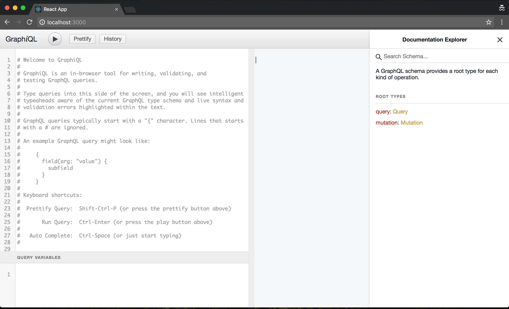
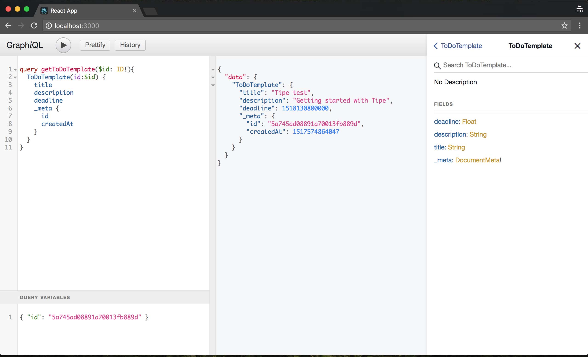

In a previous article I mentioned [Tipe](https://tipe.io/) which is a GraphQL software as a service provider "under construction". Well, their beta version has been available since the 2nd of February and as they have a cute cat logo, I signed up immediately. I saw that currently it's quite hard to check the GraphQL schema of the endpoint. Although the GraphQL playground implementation is on their roadmap, it's not available yet. So I decided to set up a [GraphiQL](https://github.com/graphql/graphiql) IDE locally for Tipe.

_The code is available on GitHub: [https://github.com/nandito/tipe-graphiql](https://github.com/nandito/tipe-graphiql)_

## Tipe

So far I've just been playing with the Tipe's admin interface. I've created some folders, templates and documents. I miss many things from their service but I know they are in beta phase so I would not complain about anything.

## Create React App

Tipe provides an API endpoint and we have to use custom request headers to get our project's data. I used [create-react-app](https://github.com/facebook/create-react-app) for bootstrapping the project. This way I saved the time of the build configuration.

```bash
$ npm install create-react-app -g # install create-react-app globally
$ create-react-app tipe-graphiql
```

This creates the `tipe-graphiql` project folder with all the necessary React configurations.

## Add GraphiQL dependency

Next I added `graphiql` as a dependency and ran the installer script.

```bash
$ cd tipe-graphiql
$ yarn add graphiql # or npm install graphiql --save
$ yarn install # or npm install
```

Now that everything is installed, it's time to add GraphiQL to the app and remove all the unused Create React App code.

## Replace sample React code with GraphiQL

Edit the `src/index.js` file: remove the service worker and the imported `App` component, then paste the code from the GraphiQL's GitHub page.

```js
import React from 'react';
import ReactDOM from 'react-dom';
import GraphiQL from 'graphiql';
import fetch from 'isomorphic-fetch';
import './index.css';
import '../node_modules/graphiql/graphiql.css'

const API_KEY = 'your_api_key';
const ORG_SECRET_KEY = 'your_org_secret';

function graphQLFetcher(graphQLParams) {
  return fetch('https://api.tipe.io/graphql', {
    method: 'post',
    headers: {
      'Content-Type': 'application/json',
      'Authorization': API_KEY,
      'Tipe-Id': ORG_SECRET_KEY,
    },
    body: JSON.stringify(graphQLParams),
  }).then(response => response.json());
}

ReactDOM.render(, document.getElementById('root'));
```

I used the [Tipe's GraphQL API request docs](https://docs.tipe.io/docs/graphql-api-request) to set up the request credentials. The endpoint url (`https://api.tipe.io/graphql`) seems generic, that's why I didn't extract it as a constant. The `API_KEY` and `ORG_SECRET_KEY` constants should be replaced with your own credentials. You can find some guides in the linked docs to get them.

I also had to include the GraphiQL styles by importing its css file from the `node_modules` folder.

Then I set the height in the `src/index.css` to stretch the IDE to fill the whole page.

```css
body {
  margin: 0;
  padding: 0;
  font-family: sans-serif;
}

html, body, #root {
  height: 100%;
}
```

## Clean up

As I don't use the `App` component and the service worker, their files can be removed.

```bash
$ rm ./src/App.*
$ rm ./src/logo.svg
$ rm ./src/registerServiceWorker.js
```

## Run the app locally

Now the app server can be started and when it runs, the GraphiQL IDE is available in the browser (http://localhost:3000/).

``` bash
$ yarn start # or npm start
```

Now I can browse the schema and test the queries!

##### GraphiQL with schema explorer in a browser



##### Example query with query variables in GraphiQL


