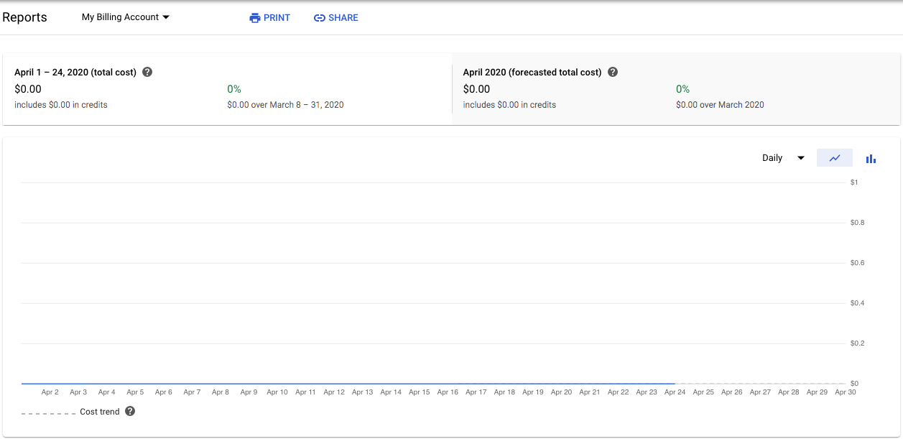
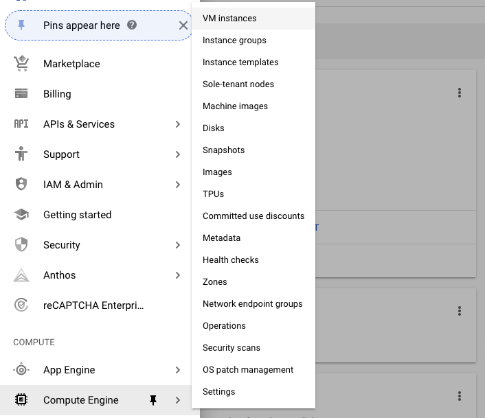
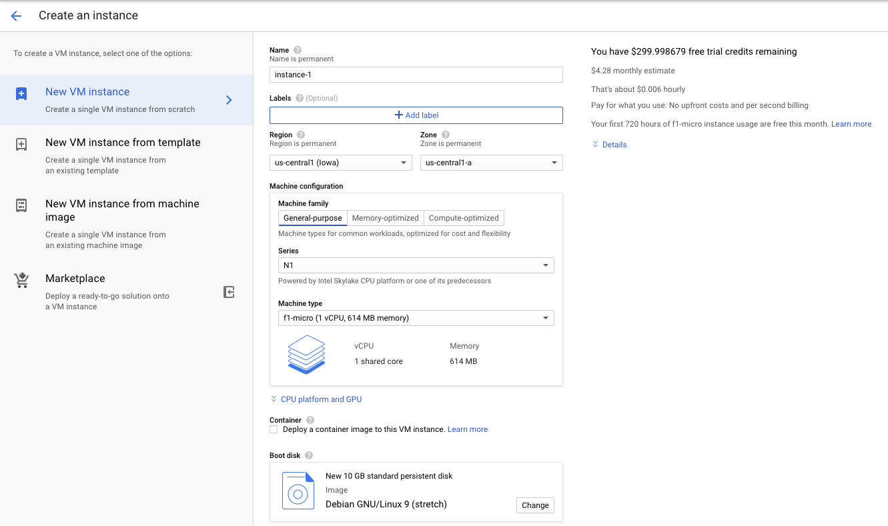

_Cover image is copied from the Ackee's GitHub repo_

## Why?

Most sites I've built are using Google Analytics (GA), the _free_ and very feature-rich website analytics tool. It's easy to set up and shows real time data on complex charts. But GA tracks the users more than I need for a personal blog. It also requires a strict privacy policy and users need to accept that notice to let the tracking start.

The "No tracking" option was on my mind as well. The browsers' tracking blockers make client-side trackers less and less accurate. However seeing some (maybe not-that-accurate) activity on my site still motivates me to keep it alive.

Another option is server-side analytics. They are fast, private and accurate. But for a non-profit personal blog with a very few visitor it simply doesn't worth to pay $7-9/mo to see the stats.

## Goals

I defined what would be the ideal tracking for my site:

* Open source
* Does not use cookies (no cookies -> no cookie policy overhead)
* Cheap (possible free) hosting

## Choice

When I was searching for alternatives I found Alec Brunelle's [Quit Google Analytics and use self-hosted Gatsby statistics with Ackee](https://medium.com/better-programming/quit-google-analytics-self-hosted-gatsby-statistics-with-ackee-846a2b4be634) post on Medium. I tried Ackee's demo and it collects exactly the data I need.

So I decided to try:

* Analytics tool: [Ackee](https://github.com/electerious/Ackee) (✅ open source; ✅ no cookies)
* Hosting: Google Cloud Platform's (GCP) [always free tier](https://cloud.google.com/free/docs/gcp-free-tier#always-free) (f1-micro)

I tried to deploy to Heroku (as Alec did in his post) but as Heroku asked for my credit card data, I was not sure if it can run on a free dyno. Or maybe I've just reached the free limit with other hobby projects.

## Steps

### Set up VM

During the VM creation GCP prompted my credit card details but promised not to charge without permission. They gave $300 free credit for the first year, too.

The services I'm using cost $0.00 / mo.

_It's up and running for 8 days now and billing report shows $0.00 for this month. I still have all of the $300 free credit._



1. Log in to Google Cloud Platform: https://console.cloud.google.com/getting-started
2. Create project (name could be anything you want)
3. Go to Compute Engine >> VM Instances



4. Enable free tier
5. Create new VM: for the always-free, select:

    * `us-central1` (Iowa) region (`us-west1` and `us-east1` is free, too)
    * `f1-micro` (1 vCPU, 0.6 GB memory)
    * Debian 9 (other Linux distro could also work but make sure to use one with free license if you want to keep it free)
    * "Allow full access to all Cloud APIs" access scope
    * Enable bot HTTP and HTTPS traffic on the Firewall



6. Reserve Static IP: go to VPC network > External IP addresses on the GCP dashboard, then select the instance and hit "Reserve Static Address" in the top bar.


### Install Ackee

1. SSH to the VM in the web by clicking the SSH button in the instance list of the VM Instances page.
2. Install Node 12 LTS (code is copied from [here](https://github.com/nodesource/distributions/blob/master/README.md#debinstall))
    ```bash
    # Using Debian, as root
    curl -sL https://deb.nodesource.com/setup_12.x | bash -
    apt-get install -y nodejs
    ```
4. Install yarn
    ```bash
    npm install -g yarn
    ```
6. Install Mongo DB: follow the [instruction in their official docs](https://docs.mongodb.com/manual/tutorial/install-mongodb-on-debian/). For me it worked without any issue, here're the commands:
    ```bash
    wget -qO - https://www.mongodb.org/static/pgp/server-4.2.asc | sudo apt-key add -
    echo "deb http://repo.mongodb.org/apt/debian stretch/mongodb-org/4.2 main" | sudo tee /etc/apt/sources.list.d/mongodb-org-4.2.list
    sudo apt-get update
    sudo apt-get install -y mongodb-org
    sudo systemctl start mongod
    sudo systemctl status mongod # just to see if it works
    sudo systemctl enable mongod # start mongo after reboot
    ```

### Make the site available

1. Set a domain: my domain uses a different DNS provider. I just created a subdomain and set an `A` record that points to the VM's reserved static IP address.
1. Install NGINX (I used [this instructions](https://linuxize.com/post/how-to-install-nginx-on-debian-9/))
    ```bash
    sudo apt-get update
    sudo apt-get install nginx
    sudo systemctl enable nginx
    ```
1. Set NGINX config, details [here](https://github.com/electerious/Ackee/blob/master/docs/SSL%20and%20HTTPS.md)
1. Install certbot for let's encrypt (more details [here](https://certbot.eff.org/lets-encrypt/debianstretch-nginx))
    ```bash
    sudo apt-get install certbot python-certbot-nginx
    sudo certbot --nginx
    sudo certbot renew --dry-run # To test automatic renewal
    ```
1. Run the app as a service: I followed [this instuctions](https://tibbo.com/linux/nodejs/service-file.html).

    Create the file `/lib/systemd/system/ackee.service` with the following contents:

    ```
    [Unit]
    Description=Ackee App
    After=network-online.target

    [Service]
    Restart=on-failure
    WorkingDirectory=/home/nandor/Ackee
    ExecStart=/usr/bin/node src/index.js

    [Install]
    WantedBy=mutli-user.target
    ```

    Reload daemon

    ```bash
    systemctl daemon-reload
    ```

    Let it run on reboot

    ```bash
    systemctl enable ackee
    ```

## Failure

First I wanted to run the Dockerized app in the f1-micro instance. I used the Container-optimized OS. But it seems that ~580 MB RAM is not enough to run the Mongo DB and the Ackee containers in the same time (+ an nginx reverse proxy + the GCP's logger container).

After some hours of struggling I decided to try to install the apps directly to Debian. This way everything worked for the first try.

## Conclusion

Well, I've spent some evenings to move my analytics from Google Analytics to another Google service (Google Cloud Platform). It's still Google, but the data now is inside a VM's database, not in GA directly.
